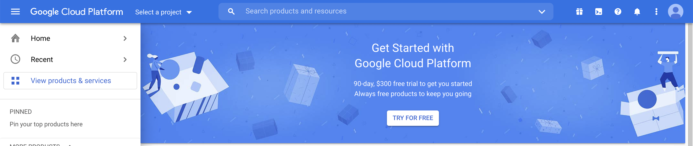
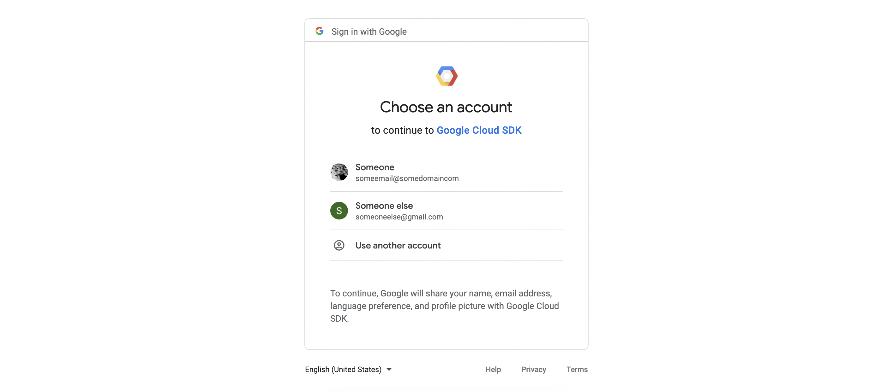
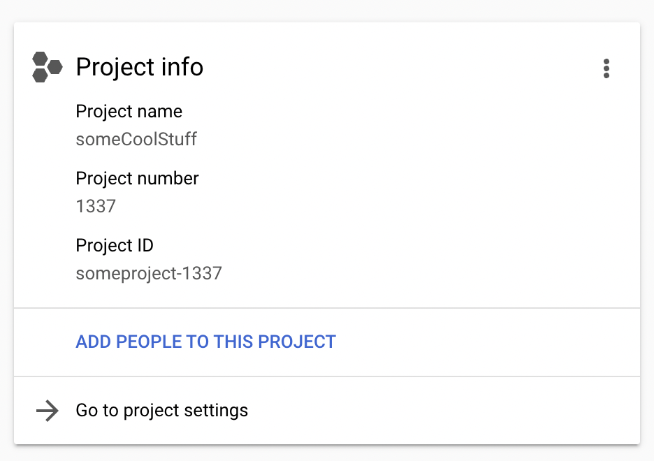
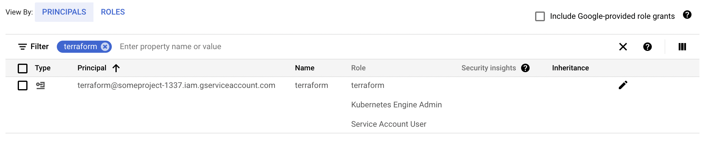

Thousands of startups start to use cloud every day and it’s truly a great way to start building your first infrastructure for new project.

<!--truncate-->

Most of the time people that are delegated with such tasks are very excited and also are quite limited in time. But the cloud is ever-expanding system with millions of features and some not really evident defaults. It is really hard to understand everything from first go, if you are not some 10 YOE professional.

But the most important thing – it’s incredibly hard to repeat all actions after something complex has already been set up. This is the moment when IaC (Infrastructure as code) comes in handy! And the best choice for that nowadays is Hashicorp Terraform. It has big community, lot’s of official modules and it is very stable and extendable.

## Start using Google Cloud

Whenever you are using personal account, or Google Workspace was already set up, actions are basically identical. You can head over to http://cloud.google.com/ to activate your cloud account. You may also want to activate your free trial, usually a message appears at the top of the page or in the center.


If you chose to proceed with this great offer, or decided to skip it for now, you are just few steps away from getting proper IaC going with your new cloud account.

## Download and install gcloud (Google Cloud SDK)

Mac users can user [brew](https://brew.sh/) for that, otherwise you can follow download instructions [here](https://cloud.google.com/sdk/docs/install).

Brew installation example:

```shell
brew install google-cloud-sdk
```

After installation is complete it’s time to authenticate your gcloud cli

```shell
gcloud auth login
```

New tab in your browser will open to choose the account to use with gcloud. Important note here – you need to choose the proper account which was used to activate your new Google Cloud.


Now that we have gcloud authenticated, we should set the project id. Project id can be found on main Dashboard page of google cloud.


Now that we have that id, let’s set it for gcloud and verify our newly added auth:

```shell
$ gcloud config set project someproject-1337
Updated property [core/project].
yellowmegaman@Dmitrys-MacBook-Air ~ % gcloud auth list
  Credentialed Accounts
ACTIVE  ACCOUNT
*       someone@somedomain.tld
To set the active account, run:
    $ gcloud config set account `ACCOUNT`
$
```
Awesome!

## Creating custom role and ServiceAccount for terraform

Terraform requires a way to interact with any cloud or service. With Google Cloud the most preferred way is ServiceAccount which is granted some roles to perform actions.

First we create the role. We want to have a role that is permitted to interact with container clusters (GKE), cloud storage buckets (GCS), and create/update/delete ServiceAccounts. You can always add more permissions, or remove them.

Save this yaml code to your disk, like `terraform-Role.yaml`

```yaml title="terraform-Role.yaml"
---
title: terraform
stage: GA
description: terraform IaC role
includedPermissions:
  - compute.instanceGroupManagers.get
  - container.clusters.create
  - container.clusters.delete
  - container.clusters.get
  - container.clusters.getCredentials
  - container.nodes.get
  - container.nodes.list
  - container.operations.get
  - iam.serviceAccounts.create
  - iam.serviceAccounts.delete
  - iam.serviceAccounts.get
  - iam.serviceAccounts.getAccessToken
  - iam.serviceAccounts.list
  - iam.serviceAccounts.update
  - storage.buckets.create
  - storage.buckets.delete
  - storage.buckets.get
  - storage.objects.create
  - storage.objects.delete
  - storage.objects.get
  - storage.objects.getIamPolicy
  - storage.objects.list
  - storage.objects.setIamPolicy
  - storage.objects.update
```

Now we can create the role (replace `<project_id>` with your value):

```shell
gcloud iam roles create "terraform" --project="<project_id>" \\
                                    --file=terraform-Role.yaml
```

Let’s create terraform ServiceAccount and couple of role bindings (replace `<project_id>` with your value):

```shell
$ gcloud iam service-accounts create "terraform" \\
                --description="Terraform IaC service account" \\
                --display-name="terraform"
$ gcloud projects add-iam-policy-binding "<project_id>" \\
   --member="serviceAccount:terraform@<project_id>.iam.gserviceaccount.com" \\
   --role="projects/<project_id>/roles/terraform"
$ gcloud projects add-iam-policy-binding "<project_id>" \\
   --member="serviceAccount:terraform@<project_id>.iam.gserviceaccount.com" \\
   --role="roles/iam.serviceAccountUser"
$ gcloud projects add-iam-policy-binding "<project_id>" \\
   --member="serviceAccount:terraform@<project_id>.iam.gserviceaccount.com" \\
   --role="roles/container.admin"
```

Now we can head over to [IAM & Admin](https://console.cloud.google.com/iam-admin/iam) in Google Cloud to verify the results:



## Creating the ServiceAccount key

Now that we have a ServiceAccount with proper roles attached, we need to obtain ServiceAccount key to provide it to terraform. Let’s create one (replace `<project_id>` with your value):

```shell
gcloud iam service-accounts keys create terraform.json \\
    --iam-account=terraform@<project_id>.iam.gserviceaccount.com
```

After running this command you will have ServiceAccount json key that can be used for IaC with terraform and for many other services that do work with Google Cloud.

To use it with terraform you can just export env variable:

```shell
export GOOGLE_CREDENTIALS=<path_to_your_key.json>
```

What the benefits of using IaC from the start?

* solid backup of configuration of all you infrastructure parts
* audit log of actions (if infra code is managed in VCS)
* predictable state of infrastructure
* hand-picked permissions, not just `Owner` role assigned to terraform as seen in many companies
* better understanding what’s happening, instead of clicking random things on Web UI