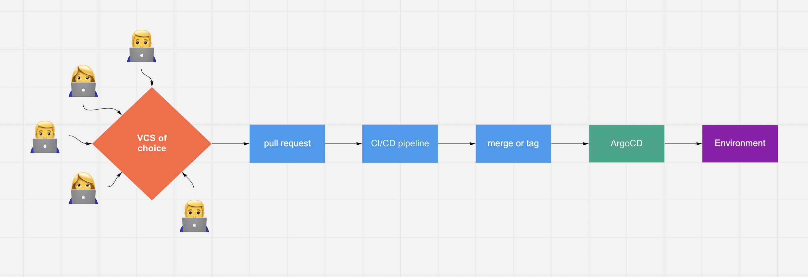
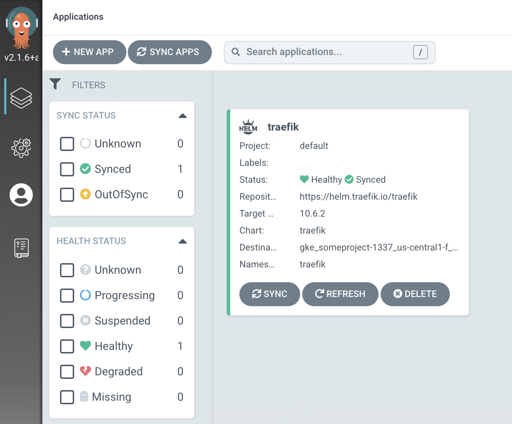
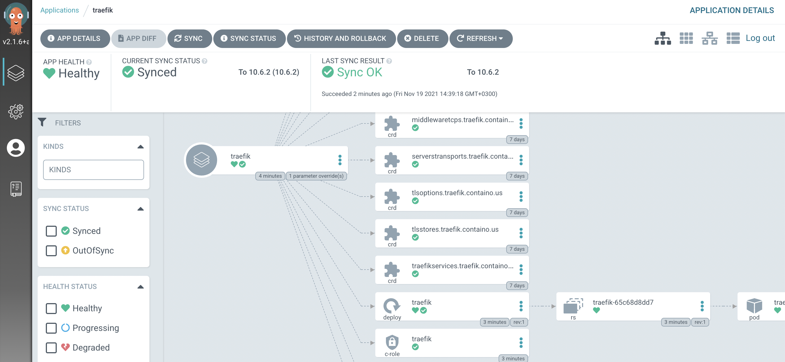

GitOps is an approach. It’s not a product, not a tool. You can deliver software updates to the cloud, to Tesla car or hobby project based on Raspberry Pi with the help of GitOps.

<!--truncate-->

Main thing to note here – unlike how operations were carried out in the past, with GitOps we can be sure not to miss *how* some operation was performed, because everything is stored (in git) now.

## Moving parts

* application or automation code
* VCS to store this code in
* GitOps component which is performing an update
* access to the environment which needs to be updated

General scheme is quite simple – you change something, update is got deployed automatically somewhere. Forget about old-school uploading of artefacts to remote host and running some commands afterwards.


## Benefits

* Deployment change is peer-reviewed
* Full audit-log of actions performed against environment are stored in git and versioned
* No need for personal access to environments, only the GitOps component has rights to perform update, on the behalf of programmatic means access like ServiceAccount
* Easy to track changes from last deployment
* Easy rollback to the previous version
* Nice web UI 😁

## ArgoCD

Let’s install ArgoCD and connect it to GKE cluster

```shell title="terminal"
helm repo add argo <https://argoproj.github.io/argo-helm>
helm repo update
helm install argocd --create-namespace \\
                      --namespace argocd \\
                      --set dex.enabled=false argo/argo-cd
```

For this example we’re skipping ArgoCD DEX component, because installation is performed locally on docker for desktop kubernetes.

Now we can get the password for admin user:
```shell title="terminal"
kubectl -n argocd get secret argocd-initial-admin-secret \\
        -o jsonpath="{.data.password}" | base64 -d
```

Port-forward ArgoCD server to access it locally:
```shell title="terminal"
kubectl port-forward service/argocd-server -n argocd 8080:443
```

Now we can install ArgoCD CLI to add remove clusters. We also do need to authenticate ourselves against our local install. Use admin password from above:
```shell
$ brew install argocd
$ argocd login 127.0.0.1:8080
WARNING: server certificate had error: x509: cannot validate certificate for 127.0.0.1 because it doesn't contain any IP SANs. Proceed insecurely (y/n)? y
Username: admin
Password:
'admin:login' logged in successfully
Context '127.0.0.1:8080' updated
$ argocd cluster list
SERVER                          NAME        VERSION  STATUS   MESSAGE
<https://kubernetes.default.svc>  in-cluster           Unknown  Cluster has no application and not being monitored.
```

We can see now that ArgoCD is authenticated and shows the cluster which it is deployed into.

Now let's add some remote GKE cluster from Google Cloud:
```shell
$ gcloud container clusters get-credentials production --zone us-central1-f --project someproject-1337
Fetching cluster endpoint and auth data.
kubeconfig entry generated for production.
$ kubectl config get-contexts
CURRENT   NAME                                          CLUSTER                                         AUTHINFO                                     NAMESPACE
          docker-desktop                                docker-desktop                                  docker-desktop
*         gke_someproject-1337_us-central1-f_production gke_someproject-1337_us-central1-f_production   gke_someproject-1337_us-central1-f_production


$ export GOOGLE_CREDENTIALS=terraform.json # we specify our ServiceAccount key
$ argocd cluster add gke_someproject-1337_us-central1-f_production
WARNING: This will create a service account `argocd-manager` on the cluster referenced by context `gke_someproject-1337_us-central1-f_argocd` with full cluster level admin privileges. Do you want to continue [y/N]? y
INFO[0004] ClusterRole "argocd-manager-role" created
INFO[0005] ClusterRoleBinding "argocd-manager-role-binding" updated
Cluster 'https://555.555.555.555' added

$ argocd cluster list
SERVER                          NAME                                             VERSION  STATUS   MESSAGE
https://555.555.555.555         gke_someproject-1337_us-central1-f_production    Unknown  Cluster has no application and not being monitored.
https://kubernetes.default.svc  in-cluster                                       Unknown  Cluster has no application and not being monitored.
$
```

What happened here?
- we got credentials for GKE cluster with the help of gcloud
- looked at available kubectl contexts
- exported ServiceAccount key location as env variable
- added cluster to ArgoCD
- checked that it was added properly

:::tip

Important thing to note here. We're using local credentials only once, after that ArgoCD creates it's own k8s ServiceAccount in target cluster, this way authentication JWT token is not expiring, as it is with gcloud.

:::


## Deployment

Now we can deploy our app. We gonna skip VCS part for this example, it requires additional configuration for ArgoCD private repos. You can check it out [here](https://argo-cd.readthedocs.io/en/release-1.8/user-guide/private-repositories/).

Save this example Traefik deployment manifest to disk:
```yaml title="Application-traefik.yaml"
---
apiVersion: argoproj.io/v1alpha1
kind: Application
metadata:
  name: traefik
spec:
  destination:
    namespace: traefik
    server: <https://555.555.555.555>
  project: default
  syncPolicy:
    automated:
      prune: true
      selfHeal: true
    syncOptions:
      - Validate=true
      - CreateNamespace=true
  source:
    path: ''
    repoURL: <https://helm.traefik.io/traefik>
    chart: "traefik"
    targetRevision: "10.6.2"
    helm:
      parameters:
      - name: service.type
        value: "ClusterIP"
```

Now we are applying it locally to our docker-desktop cluster where ArgoCD is resided. It, in turn will sync this workload to remote GKE cluster

```shell
$ kubectl -n argocd apply -f Application-traefik.yaml
$ kubectl config use-context gke_someproject-1337_us-central1-f_production
$ kubectl -n traefik get po
NAME                       READY   STATUS    RESTARTS   AGE
traefik-65c68d8dd7-qzmzp   0/1     Running   0          7s
$ 
```


Let’s check the web UI of our ArgoCD.

Open https://127.0.0.1:8080 and log in. Certificate will be invalid, but that’s OK for local testing installation. Provide admin password obtained in previous step.


Application details:


Now we have firm connection between ArgoCD GitOps component and GKE cluster, woot!

## Git part

We can now proceed with configuration of private repos to pull changes from git, or apply changes locally.

We need to place repository secret (e.g. private key) in kubernetes secrets in argocd namespace.

After that we can apply private repo configuration:

```shell
argocd repo add git@github.com:argoproj/argocd-example-apps.git \\
                --ssh-private-key-path ~/.ssh/id_rsa
```

Define the app:

```yaml
---
apiVersion: argoproj.io/v1alpha1
kind: Application
metadata:
  name: guestbook
  namespace: argocd
spec:
  destination:
    namespace: guestbook
    server: <https://555.555.555.555>
  project: default
  syncPolicy:
    automated:
      prune: true
      selfHeal: true
    syncOptions:
      - Validate=true
      - CreateNamespace=true
  source:
    path: "guestbook"
    repoURL: <https://github.com/argoproj/argocd-example-apps>
    targetRevision: HEAD
```

Check target cluster:

```shell
$ kubectl -n guestbook get po
NAME                            READY   STATUS    RESTARTS   AGE
guestbook-ui-85985d774c-ttn2p   1/1     Running   0          23s
$ 
```

From now on you can deploy applications from your private git repo. When you modify the files in `targetRevision` location, ArgoCD will update your cluster. Woot!