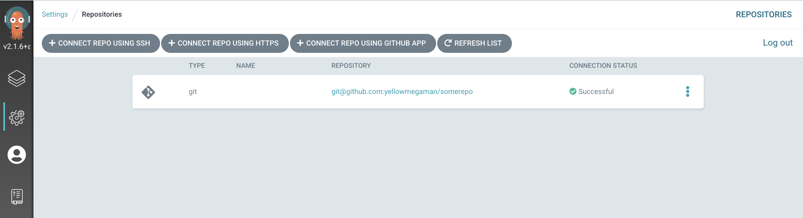
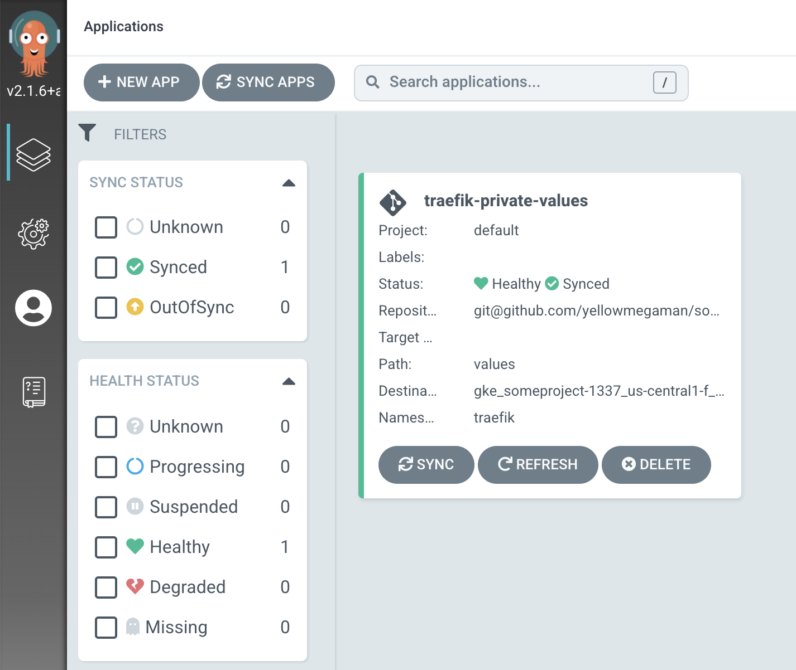

Using ArgoCD for proper GitOps is great. You define your workload, put it in VCS, point ArgoCD to it with proper credentials and you’re good. But there is a case, when you’re not the one developing some piece of software, but you do want to store it’s configuration privately.

<!--truncate-->

We’re talking about public helm charts. Copying public chart to your repo is not something you would love to do and it will bring lot of hassle – you will end up in situation when chart was updated by creators, and you need to sync or update.

But configuration is sensitive data, so you want to keep it private. This is some part of functionality not yet covered by ArgoCD itself, because you can’t specify public repo and private repo for values.yaml at the same time.

Thankfully ArgoCD is extendable with plugins.

## Traefik plugin configuration and credentials

First things first, we need to create ArgoCD plugin and add it to our installation

This is the configuration block for both our private repo with values.yaml and plugin:

```yaml title="values.yaml"
---
apiVersion: v1
kind: ConfigMap
metadata:
  name: argocd-cm
  namespace: argocd
data:
  repositories: |
    - url: git@github.com:yellowmegaman/somerepo
      sshPrivateKeySecret:
        name: some-repo-key
        key: sshPrivateKey
  configManagementPlugins: |
    - name: helm-resolver
      init:
        command: [bash, -c]
        args: ["helm repo add $REPO_NAME $REPO_URL && helm repo update"]
      generate:
        command: [bash, -c]
        args: ["helm template --include-crds -n $ARGOCD_APP_NAMESPACE $COMMAND $ARGOCD_APP_NAME $REPO_NAME/$CHART_NAME --version $CHART_VERSION"]
```

Add ssh private key to kubernetes secret:

```shell
kubectl -n argocd create secret generic some-repo-key \\
        --from-file=sshPrivateKey=$HOME/.ssh/id_ed25519
```

## Application configuration

In `yellowmegaman/somerepo` repo we have a folder `values` with file `traefik-values.yaml` with following contents:

```yaml title="traefik-values.yaml"
deployment:
  kind: DaemonSet
additionalArguments:
  - "--api=true"
  - "--api.insecure=true"
  - "--accesslog=true"
  - "--providers.kubernetesIngress.ingressClass=traefik-cert-manager"
```

We want to use it with official Traefik helm chart.

Let’s verify the installation:


Define application using helm-resolver plugin in app.yaml:

```yaml title="app.yaml"
---
apiVersion: argoproj.io/v1alpha1
kind: Application
metadata:
  name: traefik-private-values
  namespace: argocd
spec:
  destination:
    namespace: traefik
    server: <https://555.555.555.555>
  project: default
  syncPolicy:
    automated:
      prune: true
      selfHeal: true
    syncOptions:
      - Validate=true
      - CreateNamespace=true
  source:
    path: values
    plugin:
      env:
        - name:  REPO_NAME
          value: "traefik"
        - name:  REPO_URL
          value: "<https://helm.traefik.io/traefik>"
        - name:  CHART_NAME
          value: "traefik"
        - name:  CHART_VERSION
          value: "10.6.2"
        - name:  COMMAND
          value: "--values traefik-values.yaml"
      name: helm-resolver
    repoURL: git@github.com/yellowmegaman/somerepo
```

Apply application to local cluster:

```shell
kubectl -n argocd apply -f app.yaml
```

Verify installation in ArgoCD:


One of the main changes to the configuration in our `traefik-values.yaml` files was about changing deployment type to DaemonSet, let’s verify that this change was included in the deployment:

```shell 
k -n traefik get ds
```

```
$ k -n traefik get ds
NAME                     DESIRED   CURRENT   READY   UP-TO-DATE   AVAILABLE   NODE SELECTOR   AGE
traefik-private-values   1         1         1       1            1           <none>          2m38s
```

## Conclusion

Now that we have everything in place, we can change official chart version or our privately stored values to trigger an update. Woot!